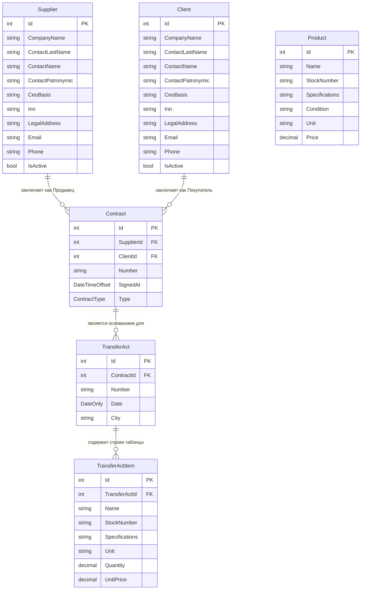

### INFORMATION: Манжосова София Александровна ИП-24-4
#### ТГ: (@Sofishokc) - https://t.me/Sofishokc
#### upd:31.07.2026
- - - - 
# Название проекта: Transfer-OfficeFurniture-Equipment
### Тема: Акт приёма-передачи 
- - - -
## Описание: Автоматизация акта приёма-передачи закупки офисной мебели и оргтехники (для компаний).
#### Статус: Работа с кодом. Создание сущностей. 

Форма акта:


Схема связи сущностей:


```
